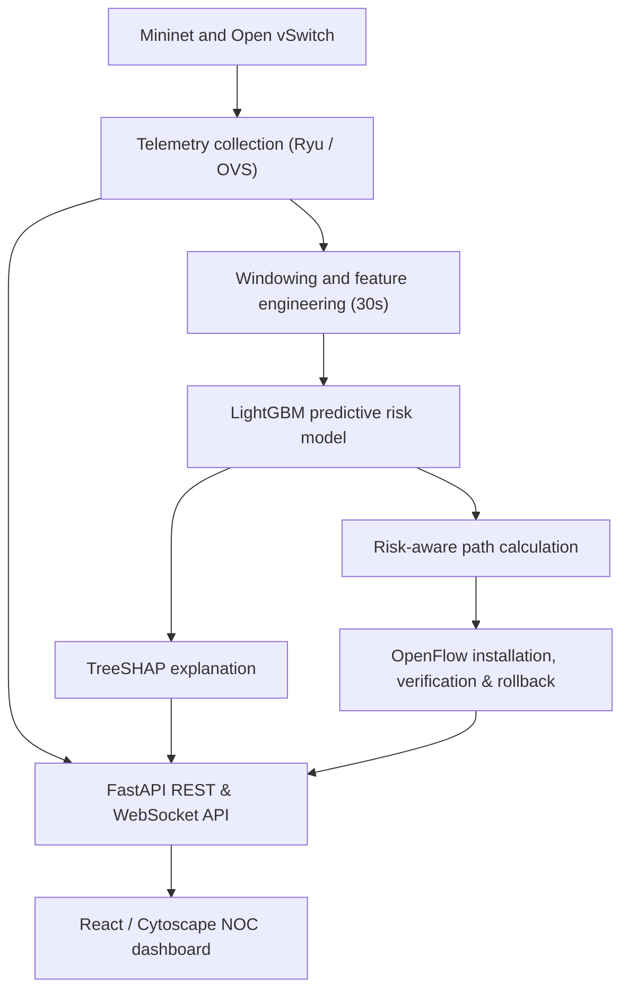

# ResiliNet

**Explainable congestion forecasting and risk-aware routing for emulated software-defined networks**

[](https://resili-net.vercel.app/)
[](https://www.python.org/)
[](https://react.dev/)
[](https://fastapi.tiangolo.com/)
[](LICENSE)

ResiliNet is an **emulation-based network digital-twin prototype** for investigating whether short-horizon congestion forecasting can improve the Quality of Service (QoS) of critical application flows. It combines software-defined network emulation, streaming telemetry, temporal feature engineering, explainable machine learning, risk-aware path calculation, and an interactive network-operations dashboard.

The public deployment demonstrates the operator workflow using clearly identified demo data and a curated sample real SDN run. Mininet-based experiment automation and end-to-end OpenFlow verification are integrated into the repository.

> **Current status:** Validated architecture, automated CI gates, and interactive prototype. Synthetic development models are explicitly distinguished from Mininet experimental evidence.

## Problem

Conventional network monitoring is usually reactive: operators learn about congestion after latency, loss, or throughput has already deteriorated. This is especially problematic when delay-sensitive flows compete with high-volume background traffic.

ResiliNet explores a proactive workflow:

1. Observe link and flow telemetry in real time.
2. Estimate whether a link is approaching a congestion condition within a 30-second horizon.
3. Explain the model output to the operator using local SHAP attribution.
4. Calculate a lower-risk alternative path subject to routing safeguards and SLA constraints.
5. Apply and verify bidirectional OpenFlow routes in an authorized Mininet/Open vSwitch laboratory with automatic rollback upon failure.
6. Compare the resulting QoS with static and reactive routing baselines.

## System overview



## Project scope and evidence status

| Capability | Repository status | Evidence level |
|---|---|---|
| React network-operations dashboard | Implemented | Production build with 6 test suites / 10 tests passing |
| Cytoscape topology visualization | Implemented | Interactive topology with node/link telemetry inspection |
| FastAPI REST & WebSocket streaming | Implemented | Async lifespan, persistent DB queries & health checks |
| OVS port-counter telemetry collector | Implemented | Ryu OpenFlow 1.3 telemetry collector |
| Temporal feature pipeline & parity | Implemented | 30s rolling features, counter reset handling, quality metadata |
| LightGBM & TreeSHAP ML pipeline | Implemented | Run-split training, automated schema & SHA-256 metadata |
| SQLite Decision Persistence Layer | Implemented | Thread-safe `DatabaseManager` with indexed query filtering |
| OpenFlow Rerouting & Rollback | Implemented | Typed `RoutingResult` with verification counter checks |
| Curated Real Experiment Sample | Implemented | `experiments/sample_real_run/` evidence artifacts committed |
| Opt-in Mock Experiments | Implemented | Strict `--allow-mock` quarantine, prevents false-positive claims |

## Experimental methodology

### Network environment

- **Mininet** for isolated network emulation
- **Open vSwitch** for OpenFlow-capable virtual switches
- **SNDlib-derived topologies** for topology experiments (`sndlib_campus`, `sndlib_backbone`)
- Controlled traffic profiles representing:
  - Tier 1: critical, latency-sensitive flows
  - Tier 2: video/education-style flows
  - Tier 3: background/bulk transfers

### Telemetry

The measurement pipeline combines:

- OVS port counters for packets, bytes, drops, and errors
- `ping`-based active probes for end-to-end latency
- `iperf3` results for achieved throughput, jitter, and loss
- Two-second raw observation polling interval
- Features computed over a rolling 30-second temporal window

Link-level congestion labels and end-to-end flow SLA outcomes are treated separately.

### Prediction task

The LightGBM model estimates whether a link will enter an experimentally defined congestion state during the following 30 seconds:

```math
P\left(y_{e,t}=1 \mid X_{e,t-W:t}\right)
```

where `e` is a link, `t` is the current time, and `W = 30\text{ s}` is the observation window.

## Technology stack

| Layer | Technologies |
|---|---|
| Network emulation | Mininet, Open vSwitch, OpenFlow 1.3, Ryu |
| Topology processing | SNDlib XML, NetworkX |
| Telemetry and experiments | Python, `ovs-ofctl`, `ovs-vsctl`, `ping`, `iperf3` |
| Machine learning | LightGBM, scikit-learn, pandas, NumPy |
| Explainability | SHAP / TreeSHAP |
| Persistence | SQLite with indexed query management |
| Backend API | FastAPI, WebSockets, Pydantic, Uvicorn |
| Frontend | React 19, TypeScript, Vite, Zustand, Cytoscape.js, Tailwind CSS |
| Quality & CI | Vitest, Testing Library, Oxlint, Prettier, Pytest, GitHub Actions |

## Repository structure

```text
ResiliNet/
|-- backend/
|   |-- app/
|   |   |-- api/             # ML prediction & explanation router
|   |   |-- db/              # SQLite DatabaseManager persistence layer
|   |   |-- services/        # Orchestrator and experiment lifecycle manager
|   |   |-- config.py        # Centralized SLA policy and thresholds
|   |   `-- main.py          # FastAPI application, streams, health checks
|   `-- tests/               # Backend Pytest test suite (34 passing tests)
|-- data_pipeline/
|   |-- collectors/          # OVS and Ryu telemetry collectors
|   |-- feature_engineering.py# Temporal feature pipeline with quality metadata
|   |-- label_generation.py  # Version-stable transform future label computation
|   `-- validate_dataset.py  # Physical telemetry and dataset quality validator
|-- experiments/
|   |-- sample_real_run/     # Curated reproducible real Mininet experiment run
|   |-- run_experiment.py    # Experiment runner with explicit opt-in mock mode
|   `-- scenarios/           # Congestion, surge, and multi-flow traffic profiles
|-- frontend/
|   |-- src/
|   |   |-- components/      # NetworkMap, InsightsPanel, Layout, Modals
|   |   |-- pages/           # Digital Twin, Flow Monitor, Intelligence, etc.
|   |   |-- services/        # API service with explicit disconnected status
|   |   `-- store/           # Zustand global state with telemetry aging
|   `-- src/**/__tests__/    # Frontend Vitest test suites (7 suites / 11 tests)
|-- ml/
|   |-- artifacts/           # Saved LightGBM model, SHA-256 metadata, eval reports
|   |-- schema.py            # ModelMetadata schema and feature definitions
|   `-- train_lightgbm.py    # Unified training & evaluation pipeline
|-- network/
|   |-- controller/          # Ryu SDN controller applications
|   |-- routing/             # Predictive router, path calculation & verification
|   |-- topologies/          # Network topologies (SNDlib, campus, testbed)
|   `-- traffic/             # Configurable traffic generators (critical, video, bulk)
|-- scripts/
|   `-- smoke_test.py        # Strict end-to-end smoke test validator
|-- LICENSE                  # MIT License
`-- README.md
```

## Quick start

### Prerequisites

- Node.js 20 or newer
- Python 3.10 or newer
- (Optional for live SDN experiments) Linux environment with Mininet and Open vSwitch

### 1. Clone the repository

```bash
git clone https://github.com/anushka06onu/ResiliNet.git
cd ResiliNet
```

### 2. Frontend setup and testing

```bash
cd frontend
npm ci
npm run format:check
npm run lint
npm run test -- --run
npm run build
npm run dev
```

Open `http://localhost:5173`.

### 3. Backend setup and testing

```bash
# From the repository root:
pip install -r backend/requirements.txt
pip install -r backend/requirements-dev.txt

# Run all backend tests:
export PYTHONPATH=$PWD
pytest backend/tests/

# Start development API server:
cd backend
python -m uvicorn app.main:app --reload --port 8000
```

Interactive API documentation is available at `http://localhost:8000/docs`, with health probes at `/health/live` and `/health/ready`.

### 4. ML Model Training & Artifact Generation

```bash
# Generate synthetic development dataset and train LightGBM:
python ml/train_lightgbm.py --generate-synthetic

# Or train on a specified dataset CSV:
python ml/train_lightgbm.py --data path/to/dataset.csv
```

All training artifacts (`lightgbm_model.txt`, `model_metadata.json`, `evaluation_report.json`, `test_predictions.csv`, `feature_schema.json`) are automatically exported with matching `run_id` and full SHA-256 dataset digests.

## Continuous Integration Gates

Every pull request and commit to `main` must pass both automated GitHub Actions gates:

- **Python CI**: Trailing whitespace check (`git diff --check`), dependency installation, and complete backend test suite execution (`pytest backend/tests/`).
- **Frontend CI**: Clean dependency install (`npm ci`), Prettier format validation (`npm run format:check`), Oxlint static analysis (`npm run lint`), test suite execution (`npm run test -- --run`), and production bundle compilation (`npm run build`).

## License

This project is released under the terms of the [MIT License](LICENSE).
