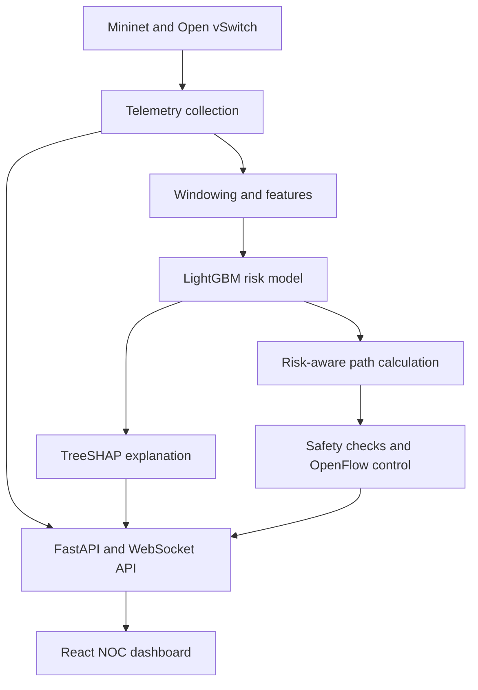

# ResiliNet

**Explainable congestion forecasting and risk-aware routing for emulated software-defined networks**

[](https://resili-net.vercel.app/)
[](https://www.python.org/)
[](https://react.dev/)
[](https://fastapi.tiangolo.com/)
[](LICENSE)

ResiliNet is an **emulation-based network digital-twin prototype** for investigating whether short-horizon congestion forecasting can improve the Quality of Service (QoS) of critical application flows. It combines software-defined network emulation, streaming telemetry, temporal feature engineering, explainable machine learning, risk-aware path calculation, and an interactive network-operations dashboard.

The public deployment currently demonstrates the intended operator workflow using clearly identified demo data. Mininet-based experiment automation, real-data model validation, and end-to-end OpenFlow verification remain active development work.

> **Current status:** Architecture and interactive prototype. The committed ML artifact was developed with synthetic telemetry and must not be interpreted as final evidence of performance on physical or Mininet-generated networks.

## Problem

Conventional network monitoring is usually reactive: operators learn about congestion after latency, loss, or throughput has already deteriorated. This is especially problematic when delay-sensitive flows compete with high-volume background traffic.

ResiliNet explores a proactive workflow:

1. Observe link and flow telemetry.
2. Estimate whether a link is approaching a congestion condition.
3. Explain the model output to the operator.
4. Calculate a lower-risk path subject to routing safeguards.
5. Apply and verify the route in an authorized Mininet/Open vSwitch laboratory.
6. Compare the resulting QoS with static and reactive routing baselines.

## System overview



## Project scope and evidence status

| Capability | Repository status | Evidence level |
|---|---|---|
| React network-operations dashboard | Implemented | Public interactive deployment |
| Cytoscape topology visualization | Implemented | Demo topology with selectable nodes and links |
| FastAPI REST and WebSocket skeleton | Implemented | Development backend |
| OVS port-counter collector | Prototype implemented | Requires a running Linux/OVS laboratory |
| Temporal feature engineering | Prototype implemented | Development pipeline |
| LightGBM and TreeSHAP integration | Prototype implemented | Currently based on synthetic development data |
| SNDlib-to-Mininet adapter | Prototype implemented | Requires validation using selected SNDlib XML instances |
| Containerized Mininet environment | Development scaffold implemented | Requires local privileged-container validation |
| Risk-aware path calculator | Prototype implemented | Uses NetworkX weighted shortest paths |
| Verified OpenFlow rerouting | In progress | Port mapping, bidirectional rules, failure handling, and route verification remain incomplete |
| Static/reactive/predictive experiment campaign | Planned | No final comparative results reported yet |
| Historical experiment replay | Planned | Replay service and artifact generation remain incomplete |

This table is intentionally explicit so that interface demonstrations are not confused with completed experimental results.

## Intended experimental methodology

### Network environment

- **Mininet** for isolated network emulation
- **Open vSwitch** for OpenFlow-capable virtual switches
- **SNDlib-derived topologies** for topology experiments
- Controlled traffic profiles representing:
  - Tier 1: critical, latency-sensitive flows
  - Tier 2: video/education-style flows
  - Tier 3: background/bulk transfers

These profiles emulate QoS characteristics; they do not carry actual medical or educational content.

### Telemetry

The proposed measurement pipeline combines:

- OVS port counters for packets, bytes, drops, and errors
- `ping`-based active probes for end-to-end latency
- `iperf3` results for achieved throughput, jitter, and loss
- One-second raw observations
- Features generated every five seconds
- Rolling temporal context over the preceding 60 seconds

Link-level congestion labels and end-to-end flow SLA outcomes are treated separately. End-to-end latency is not automatically attributed to an individual link.

### Prediction task

The intended model estimates whether a link will enter an experimentally defined congestion state during the following 30 seconds:

```math
P\left(y_{e,t}=1 \mid X_{e,t-W:t}\right)
```

where `e` is a link, `t` is the current time, and `W` is the observation window. Final thresholds will be documented as experimental choices rather than universal telecommunications standards.

### Evaluation protocol

Final evaluation will:

- Split complete experiment runs rather than individual telemetry rows
- Prevent overlapping windows from crossing dataset partitions
- Fit preprocessing only on training data
- Select thresholds using validation data
- Preserve an untouched test partition
- Compare static-threshold, logistic-regression, random-forest, and LightGBM approaches
- Report PR-AUC, ROC-AUC, precision, recall, F1, Brier score, calibration, false-positive rate, inference latency, and warning lead time
- Compare static, reactive, and predictive routing under matched scenarios and random seeds

No final Mininet-derived performance values are claimed in this README.

## Dashboard

The React dashboard is organized into eight views:

1. **Network Overview** - high-level network and alert status
2. **Digital Twin** - interactive Cytoscape topology and element inspection
3. **Flow & SLA Monitor** - application-flow and service-level view
4. **Predictive Intelligence** - model and explanation presentation
5. **Routing Decisions** - routing workflow, safeguards, and comparison structure
6. **Simulation & Replay** - planned laboratory and replay controls
7. **Evidence & Methodology** - provenance and methodological documentation
8. **System Health & Audit** - connection and subsystem-status presentation

The interface is designed to distinguish four data modes:

- `LIVE LAB`: genuine telemetry from an active Mininet/OVS experiment
- `EXPERIMENT REPLAY`: stored telemetry from a completed experiment
- `DEMO DATA`: generated values used only to demonstrate the interface
- `DISCONNECTED`: no valid data source

Only the first two modes should be used as experimental evidence.

## Technology stack

| Layer | Technologies |
|---|---|
| Network emulation | Mininet, Open vSwitch, OpenFlow |
| Topology processing | SNDlib XML, NetworkX |
| Telemetry and experiments | Python, `ovs-ofctl`, `ovs-vsctl`, `ping`, `iperf3` |
| Machine learning | LightGBM, scikit-learn, pandas, NumPy |
| Explainability | SHAP / TreeSHAP |
| Backend | FastAPI, WebSockets, Pydantic |
| Frontend | React, TypeScript, Vite, Zustand, Cytoscape.js, Tailwind CSS |
| Deployment | Vercel for the public frontend demo |

## Repository structure

```text
ResiliNet/
|-- backend/                 # FastAPI application and prediction endpoints
|-- controller/              # Planned controller and flow-management modules
|-- data_pipeline/           # OVS collection, windowing, labels, and features
|-- docs/                    # Planned dataset/model cards and reports
|-- experiments/             # Planned experiment matrix, runner, and results
|-- frontend/                # React/TypeScript dashboard
|-- ml/                      # Model training, evaluation, calibration, and SHAP
|-- network/                 # Topologies, traffic profiles, scenarios, routing prototype
|-- replay/                  # Planned replay generation and serving
|-- routing/                 # Planned policy-comparison modules
|-- docker-compose.yml
|-- Makefile
`-- README.md
```

## Quick start

### Prerequisites

For the public-style dashboard and API development:

- Node.js 20 or newer
- Python 3.10 or newer

For network emulation:

- A Linux environment
- Mininet
- Open vSwitch
- `iperf3`
- Appropriate local privileges to create and manage an isolated virtual network

Run Mininet/OpenFlow experiments only in systems and networks that you own or are explicitly authorized to use.

### 1. Clone the repository

```bash
git clone https://github.com/anushka06onu/ResiliNet.git
cd ResiliNet
```

### 2. Start the frontend

```bash
cd frontend
npm install
npm run dev
```

Open `http://localhost:5173`.

### 3. Start the development API

From a second terminal:

```bash
cd backend
python -m venv .venv
source .venv/bin/activate
pip install -r requirements.txt
uvicorn app.main:app --reload --port 8000
```

The development API is available at `http://localhost:8000`, with interactive documentation at `http://localhost:8000/docs`.

> The current frontend contains localhost development endpoints. Configure environment-based API and WebSocket URLs before deploying a connected backend.

### 4. Build the frontend

```bash
cd frontend
npm run build
```

### 5. Run the development ML pipeline

```bash
pip install -r backend/requirements.txt
python ml/train_lightgbm.py
```

The current training script can generate synthetic development telemetry when no dataset is present. Any resulting metrics must be labelled as synthetic-pipeline results, not Mininet or real-network performance.

## Configuration required for connected deployment

Before connecting the Vercel frontend to a hosted backend, replace hard-coded localhost URLs with environment variables such as:

```text
VITE_API_BASE_URL=https://your-api.example.com/api/v1
VITE_WS_BASE_URL=wss://your-api.example.com/api/v1/stream
```

The backend should explicitly identify the provenance of every event:

```json
{
  "mode": "DEMO_DATA",
  "source": "generated_interface_demonstration",
  "experiment_id": null
}
```

## Reproducibility checklist

Before publishing final experimental results, the repository should include:

- Completed experiment matrix and runner
- Selected SNDlib source files or documented download instructions
- Scenario parameters and random seeds
- Raw telemetry or a versioned derived dataset
- Train, validation, and test experiment identifiers
- Saved preprocessing schema and feature order
- Model hyperparameters and decision threshold
- Calibration procedure
- Per-model predictions and evaluation script
- OpenFlow installation logs
- Route-verification evidence from switch and flow counters
- Static, reactive, and predictive policy comparisons
- Dataset card, model card, limitations, and results report

## Known limitations

- The public deployment is an interface demonstration and cannot run privileged Mininet networking on Vercel.
- The committed development dataset is synthetic.
- Current model artifacts do not establish performance on unseen Mininet or physical-network telemetry.
- Several experiment, controller, policy-comparison, documentation, and replay modules are placeholders.
- The OpenFlow routing prototype currently assumes an output port instead of resolving verified topology-to-port mappings.
- The Mininet container requires privileged networking and is intended only for an authorized local laboratory environment.
- Successful command execution is not yet equivalent to verified end-to-end rerouting.
- Emulated results will not automatically generalize to production or carrier networks.
- SHAP explains model behavior; it does not establish causal relationships.

## Roadmap

- [ ] Replace all silent mock fallbacks with explicit data-mode transitions
- [x] Configure environment-based REST and WebSocket endpoints
- [ ] Align frontend request contracts with FastAPI endpoints
- [ ] Connect streamed telemetry to the Zustand store and Cytoscape graph
- [ ] Implement recorded experiment replay
- [ ] Complete scenario and experiment automation
- [ ] Resolve real OpenFlow ports and install bidirectional flow rules
- [ ] Verify rerouting using counters and end-to-end probes
- [ ] Generate Mininet telemetry across multiple topologies and scenarios
- [ ] Calibrate the selected model and choose a validation-based threshold
- [ ] Run matched static, reactive, and predictive routing comparisons
- [ ] Replace demonstration values with versioned experimental artifacts
- [ ] Complete dataset card, model card, results, limitations, and contribution records
- [ ] Add automated tests and continuous integration
- [ ] Improve mobile responsiveness and accessibility

## Contributing

Issues and focused pull requests are welcome. Please distinguish clearly between:

- Interface/demo behavior
- Synthetic-pipeline development results
- Mininet-derived experimental evidence
- Physical-network evidence

New result claims should include the generating script, configuration, data provenance, and reproducible evaluation artifact.

## Citation

If you use or discuss ResiliNet, cite the repository URL and the exact commit used. A complete `CITATION.cff` record will be added before a research release.

## License

This project is released under the terms in [LICENSE](LICENSE).

---

**ResiliNet is a research and engineering prototype. It is not a production network controller and should not be deployed on networks without explicit authorization, testing, and operational safeguards.**
