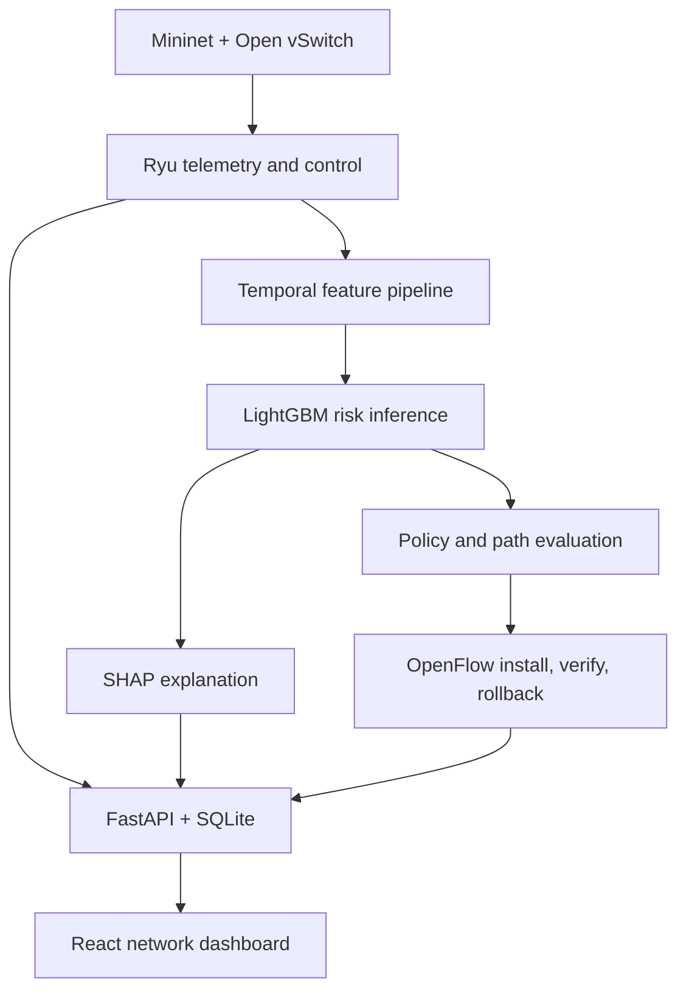
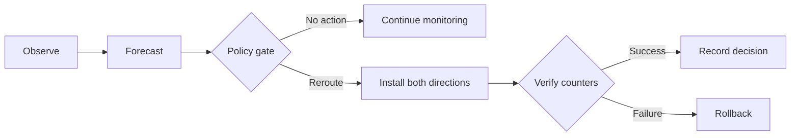

# ResiliNet

<p align="center">
  <strong>Explainable congestion forecasting and risk-aware routing for software-defined network emulation</strong>
</p>

<p align="center">
  <a href="https://resili-net.vercel.app/"></a>
  <a href="https://github.com/anushka06onu/ResiliNet/actions"></a>
  <a href="https://github.com/anushka06onu/ResiliNet/actions"></a>
  <a href="LICENSE"></a>
</p>

## Overview

ResiliNet is an **emulation-based network digital-twin research prototype** for studying whether short-horizon congestion forecasting can support safer Quality-of-Service (QoS) routing decisions.

The system combines Mininet and Open vSwitch network emulation, Ryu-based OpenFlow control, streaming telemetry, temporal feature engineering, LightGBM inference, SHAP explanations, policy-aware rerouting, a FastAPI service layer, and an interactive React operations dashboard.

ResiliNet compares three routing strategies under reproducible traffic scenarios:

- **Static (`no_reroute`)** - preserves the original route.
- **Reactive (`reactive_threshold`)** - reroutes after a measured SLA violation.
- **Predictive (`predictive_ml`)** - may reroute when forecast risk exceeds the configured threshold and safety conditions are satisfied.

> [!IMPORTANT]
> ResiliNet is a research and educational prototype evaluated in an emulated network environment. It is not a production network controller, medical device, or clinically validated system. Healthcare-style traffic classes are used only as an application scenario for service-aware networking.

## Motivation

Traditional monitoring is reactive: an operator observes congestion only after latency, packet loss, or throughput has deteriorated. For delay-sensitive services, responding after an SLA violation may be too late.

ResiliNet investigates a proactive control loop:

1. Collect link and flow telemetry.
2. Build rolling temporal features.
3. estimate the probability of congestion within a short forecast horizon.
4. Explain the model output with local feature attribution.
5. Compare candidate routes using risk and SLA constraints.
6. Install and verify bidirectional OpenFlow rules.
7. Roll back safely if installation or verification fails.
8. Preserve the complete experiment trail for later analysis.

## System architecture



### Decision lifecycle



## Core capabilities

### Network emulation and control

- Mininet scenarios with Open vSwitch and OpenFlow 1.3
- Ryu controller integration for telemetry and flow-rule management
- Bidirectional rule installation with deterministic flow cookies
- Route verification using observed flow counters
- Cooldown, rollback, and failure-recording safeguards
- Service-aware traffic classes for critical, video, and bulk flows

### Machine learning and explainability

- LightGBM binary congestion-risk model
- Rolling-window feature engineering with counter-reset handling
- Versioned model metadata and feature schema
- Model, dataset, topology, scenario, and controller fingerprints
- Local SHAP explanations for operator-facing predictions
- Prediction-to-observation alignment at the configured forecast horizon

### Experiment engineering

- Four scenarios: normal operation, gradual congestion, sudden surge, and concurrent flows
- Three comparable routing policies with centralized name normalization
- Seed-controlled campaign specification
- Six-run pilot and 60-run full campaign orchestration
- Isolated result directories with overwrite protection
- Before/after flow tables and port-state capture
- Ping, iperf, telemetry, prediction, decision, and event artifacts
- SHA-256 manifests and path-contained artifact validation
- Campaign-level exclusions, missing-run detection, and data-quality reports
- Paired policy comparisons, confidence intervals, and effect-size calculation

### Application layer

- FastAPI REST and WebSocket interfaces
- SQLite persistence for telemetry and routing decisions
- React, TypeScript, Zustand, and Cytoscape.js dashboard
- Network topology, link state, prediction, flow, experiment, and replay views
- Explicit disconnected/demo states rather than hidden synthetic substitution

## Routing policies

| CLI policy | Scientific label | Trigger | Intended role |
|---|---|---|---|
| `static` | `no_reroute` | Never reroutes automatically | Baseline |
| `reactive` | `reactive_threshold` | Measured SLA violation | Reactive baseline |
| `predictive` | `predictive_ml` | Forecast threshold plus routing safeguards | Proposed policy |

Centralized policy normalization prevents the API, runner, controller, evaluator, and manifests from silently using different labels.

## Experimental scenarios

| Scenario | Purpose |
|---|---|
| `normal` | Establish behavior without deliberate congestion |
| `gradual_congestion` | Introduce a controlled progressive impairment |
| `sudden_surge` | Evaluate response to an abrupt traffic increase |
| `concurrent_flows` | Compare service classes under competing traffic |

The default campaign configuration uses five seeds across four scenarios and three policies, producing an expected **60-run matrix**.

## Evidence status

The repository deliberately separates **software verification** from **scientific performance validation**.

| Evidence | Status | Interpretation |
|---|---|---|
| Backend and frontend automated tests | Implemented | Verifies application behavior and regression safety |
| Frontend production build | Implemented | Confirms the dashboard compiles successfully |
| Mock six-run pilot | Completed | Verifies campaign orchestration only |
| Mock 60-run matrix | Completed | Verifies matrix generation, isolation, manifests, and evaluator plumbing only |
| Committed sample evidence | Constructed fixture | Used for parser, checksum, API, and interface testing |
| Real Mininet pilot | Not yet reported | Required before making empirical performance claims |
| Real 60-run comparative campaign | Not yet reported | Required for policy comparison and statistical conclusions |
| Predictive-policy superiority | **Not claimed** | Must be demonstrated using eligible real Mininet runs |

Mock runs are marked with `data_origin: mock` and excluded from empirical analysis. The committed sample directory is governed by its manifest fields `mode: FIXTURE`, `data_origin: constructed_fixture`, and `real_experiment: false` regardless of its legacy directory name.

## Technology stack

| Layer | Technologies |
|---|---|
| Network | Mininet, Open vSwitch, OpenFlow 1.3, Ryu |
| Routing and topology | Python, NetworkX |
| Traffic and measurement | `ping`, `iperf3`, `tc netem`, `ovs-ofctl` |
| Machine learning | LightGBM, scikit-learn, pandas, NumPy |
| Explainability | SHAP / TreeSHAP |
| Backend | FastAPI, Pydantic, Uvicorn, WebSockets |
| Persistence | SQLite |
| Frontend | React 19, TypeScript, Vite, Zustand, Cytoscape.js, Tailwind CSS |
| Validation | Pytest, Vitest, Testing Library, Oxlint, Prettier, GitHub Actions |

## Repository structure

```text
ResiliNet/
├── backend/
│   ├── app/
│   │   ├── api/                 # Prediction and explanation routes
│   │   ├── db/                  # SQLite persistence
│   │   ├── services/            # Orchestration and experiment lifecycle
│   │   └── main.py              # FastAPI application
│   └── tests/                   # Backend test suite
├── data_pipeline/
│   ├── collectors/              # Telemetry collection
│   ├── feature_engineering.py   # Temporal feature generation
│   └── validate_dataset.py      # Dataset quality checks
├── experiments/
│   ├── scenarios/               # Four controlled Mininet scenarios
│   ├── artifact_validator.py    # Central artifact and schema validation
│   ├── campaign.yaml            # Pilot and full experiment matrices
│   ├── evidence_collector.py    # Flow, port, event, and traffic evidence
│   ├── evaluate_campaign.py     # Statistical campaign evaluation
│   ├── run_campaign.py          # Pilot/full campaign orchestrator
│   └── run_experiment.py        # Single-run lifecycle
├── frontend/
│   └── src/                     # React dashboard, services, state, and tests
├── ml/
│   ├── artifacts/               # Model and versioned evaluation metadata
│   └── train_lightgbm.py        # Training pipeline
├── network/
│   ├── controller/              # Ryu controller
│   ├── routing/                 # Policies and predictive router
│   ├── topologies/              # Test and campus-style topologies
│   └── traffic/                 # Traffic generators
└── scripts/
    └── smoke_test.py            # End-to-end smoke validation
```

## Getting started

### Prerequisites

For the dashboard and API:

- Python 3.10+
- Node.js 20+
- npm

For real SDN experiments:

- Linux
- Mininet
- Open vSwitch
- Ryu
- `iperf3`, `ping`, and `tc`
- `sudo` permission for isolated network-emulation commands

### 1. Clone the repository

```bash
git clone https://github.com/anushka06onu/ResiliNet.git
cd ResiliNet
```

### 2. Install and start the backend

```bash
python3 -m venv .venv
source .venv/bin/activate

pip install -r backend/requirements.txt
pip install -r backend/requirements-dev.txt

export PYTHONPATH="$PWD"
export RESILINET_INTERNAL_TOKEN="replace-with-a-long-random-development-token"

uvicorn backend.app.main:app --reload --host 0.0.0.0 --port 8000
```

API documentation is available at `http://localhost:8000/docs`.

### 3. Install and start the frontend

In a second terminal:

```bash
cd frontend
npm ci
npm run dev
```

Open `http://localhost:5173`.

## Running the test suites

### Backend

```bash
export PYTHONPATH="$PWD"
pytest backend/tests/
```

### Frontend

```bash
cd frontend
npm ci
npm run format:check
npm run lint
npm test -- --run
npm run build
```

## Training the development model

Generate a synthetic development dataset and its versioned artifacts:

```bash
python ml/train_lightgbm.py --generate-synthetic
```

Or train from a supplied CSV:

```bash
python ml/train_lightgbm.py --data path/to/dataset.csv
```

Generated artifacts include the LightGBM model, model metadata, feature schema, evaluation report, and test predictions. Synthetic training is useful for pipeline development; it is not evidence of real-network generalization.

## Running experiments

### Pipeline-only mock validation

Mock mode is opt-in and must not be used for performance claims:

```bash
export RESILINET_INTERNAL_TOKEN="replace-with-a-long-random-development-token"

# Six-run pipeline check
python experiments/run_campaign.py --pilot --allow-mock --duration 5

# Full matrix pipeline check
python experiments/run_campaign.py --full --allow-mock --duration 5
```

### Real Mininet campaign

Start the backend with the same internal token, verify Mininet/Open vSwitch/Ryu availability, then run:

```bash
export RESILINET_INTERNAL_TOKEN="replace-with-the-same-token-used-by-the-backend"

# Validate the environment with the pilot first
python experiments/run_campaign.py --pilot

# Run the complete campaign only after reviewing pilot artifacts
python experiments/run_campaign.py --full
```

Real runs fail closed when required synchronization, finalization, or evidence is unavailable. Use `--overwrite` only when intentionally replacing an existing run with the same experiment identifier.

## Experiment artifacts

Each run is isolated under `experiments/results/<experiment_id>/` and may contain:

```text
manifest.json
SHA256SUMS
telemetry.csv
predictions.csv
routing_decisions.jsonl
events.jsonl
scenario_parameters.json
evidence_report.json
controller.log
scenario.log
switches/
traffic/
```

The manifest records execution mode, data origin, policy, seed, hashes, process outcomes, evidence completeness, artifact row counts, and analysis eligibility. The evaluator rejects failed, incomplete, mock, malformed, or checksum-invalid runs.

Campaign-level outputs include:

- aggregated metrics
- excluded-run reasons
- missing, duplicate, and unexpected combinations
- data-quality issues
- prediction metrics
- paired policy comparisons
- confidence intervals and effect sizes

## Selected API endpoints

| Method | Endpoint | Purpose |
|---|---|---|
| `GET` | `/health/live` | Process liveness |
| `GET` | `/health/ready` | Dependency readiness |
| `WS` | `/api/v1/stream` | Live dashboard updates |
| `POST` | `/api/v1/telemetry/ingest` | Ingest controller telemetry |
| `POST` | `/api/v1/topology/ingest` | Update the active topology |
| `GET` | `/api/v1/topology/current` | Retrieve the current topology |
| `GET` | `/api/v1/flows` | List tracked flows |
| `GET` | `/api/v1/routing/decisions` | Query routing decisions |
| `GET` | `/api/v1/experiments` | List experiment records |
| `GET` | `/api/v1/replay/{experiment_id}` | Replay an experiment |

Internal configure/finalize routes require the `X-ResiliNet-Internal-Token` header and are intended only for communication between the experiment runner and backend.

## Evaluation protocol

A defensible comparison should follow this sequence:

1. Run the real six-run pilot.
2. Confirm environment, timestamps, traffic generation, netem state, controller synchronization, and artifact checksums.
3. Inspect exclusions and parser-quality reports.
4. Run the full 60-run Mininet campaign without changing model, topology, policy thresholds, or campaign configuration.
5. Verify the exact scenario-policy-seed matrix.
6. Report uncertainty, paired comparisons, effect sizes, failed runs, and missing values.
7. Separate predictive classification quality from end-to-end QoS outcomes.
8. Publish only conclusions supported by eligible runs.

Recommended primary outcomes include end-to-end RTT, packet loss, throughput, SLA-violation duration, reroute success, rollback frequency, and service-class-specific performance. Model evaluation includes precision, recall, specificity, F1, Brier score, false-alert rate, and missed-event rate.

## Current limitations

- Real Mininet pilot and full-campaign results are not yet published in this repository.
- The included development model and synthetic data do not establish real-network generalization.
- Mininet is an emulator; conclusions may not transfer directly to physical or production networks.
- The proposed predictive policy has not yet been shown to outperform the static and reactive baselines.
- Application traffic represents service classes, not real clinical systems or patient data.
- Controller security, distributed deployment, failure recovery, and scale testing require further work before any production use.
- The public dashboard is a demonstration interface and should not be interpreted as a live production network.

## Roadmap

- [ ] Execute and publish the real six-run Mininet pilot
- [ ] Complete the real 60-run comparative campaign
- [ ] Add campaign plots and a concise results report
- [ ] Validate the model on independently collected emulation runs
- [ ] Evaluate calibration and decision-threshold sensitivity
- [ ] Test additional topologies, traffic intensities, and failure modes
- [ ] Measure controller overhead and scalability
- [ ] Package a reproducible Linux/Mininet environment
- [ ] Add a short architecture and experiment demonstration video

## Responsible use

ResiliNet is intended for authorized laboratory networks, reproducible emulation, and academic study. Do not connect experimental routing automation to infrastructure you do not own or administer. No patient data is used, and the project does not make clinical decisions.

## Author

**Fateha Hossain Anushka**

Computer Science and Engineering
[GitHub](https://github.com/anushka06onu) · [LinkedIn](https://www.linkedin.com/in/fatehahossainanushka) · [Live Demo](https://resili-net.vercel.app/)

## License

Distributed under the [MIT License](LICENSE).
